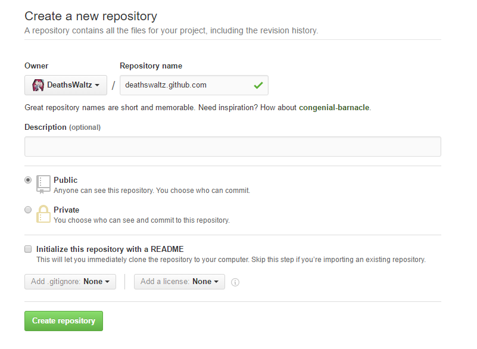

## 安装环境
 安装git和Node.js，[git下载地址](https://git-scm.com/downloads),[Node.js下载地址](https://nodejs.org/en/download/)
 安装完成之后，就可进行hexo博客框架的安装
   <!--more-->
 这些都在本地完成的

 ```bash
 npm install -g hexo-cli
 ```
 执行完成之后hexo就安装成功了，第一步结束，环境配置完毕就可以开始创建自己的博客了

## Github上创建仓库
 创建与用户名对应的仓库，仓库名为your_user_name.github.io(your_user_name.github.com的好像也可以)
 

## 博客的创建

 ### 初始化项目
  ```bash
  #init后的名字可以随便起，不会有有什么影响
  hexo init deathswaltz.github.io
  cd deathswaltz.github.io
  npm install
  ```
  init后面是项目的名字，这样就会生成一个deathswaltz.github.io的文件夹
 ### 基础配置
  打开创建出文件夹下的_config.yml文件进行配置，可以使用sublime text，这是个非常好用的编辑器
  ```coffeescript
    #博客名字
    title: Hexo
    #子标题
    subtitle:
    #博客描述
    description:
    #作者名字
    author: deathswaltz
    #语言
    language: zh-Hans
    #头像
    avatar: https://avatars0.githubusercontent.com/u/10008846?v=3&s=460
    #主题
    theme: next

    deploy:
      #使用Git发布
      type: git
      #仓库地址
      repository: https://github.com/DeathsWaltz/DeathsWaltz.github.io.git
      branch: master
  ```
  其实到现在博客差不多已经搭建的好了
  现在可以执行下列命令来在本地运行起来
  ```bash
  hexo clean
  hexo g
  hexo s
  ```
  然后再浏览器通过[http://localhost:4000](http://localhost:4000)来进行访问

   发布到Github上使用以下命令：
  ```bash
  hexo clean
  hexo g
  hexo d
  ```
  或者
  ```bash
  hexo clean
  hexo d -g
  ```
  发布到Github上之后可以使用刚才创建的仓库名来访问，如：[deathswaltz.github.io](http://deathswaltz.github.io)
 ### 安装主题
  >hexo的默认主题是landscape，个人觉得这个主题并不怎么好看，所以使用next主题。
  在git bash 执行git clone [https://github.com/iissnan/hexo-theme-next](https://github.com/iissnan/hexo-theme-next) themes/next,这样即可进行next主题下载

  >下载完成后，在博客所在路径下的themes文件夹下面可以看到一个名为next的文件夹。要应用这个主题，需要我们修改站点配置文件_config.yml，注意这个_config.yml是themes/next下的不要和博客主目录下的弄混了，把之前的theme: landscape修改为theme: next。这时可以hexo   g和hexo s，然后在刷新浏览器就可以看到博客是next的主题了

 >NexT 通过 Scheme 提供主题中的主题。 Mist 是 NexT 的第一款 Scheme。启用 Mist 仅需在 主题配置文件 中将 #scheme: Mist 前面的 # 注释去掉即可。

 菜单配置在 主题配置文件 的 menu。 若站点运行在子目录中，请将链接前缀的 / 去掉。默认支持的菜单项有：
  ```coffeescript
    menu:
    home: /
    archives: /archives
    #about: /about
    #categories: /categories
    tags: /tags
    #commonweal: /404.html
  ```
###  创建 “关于我” 页面
  新建一个 about 页面：
  ```bash
  hexo new page "about"
  ```
  菜单显示 about 链接，在主题的 _configy.yml 设置中将 menu 中 about 前面的注释去掉即可。

### 创建分类页面
  添加一个 分类 页面，并在菜单中显示页面链接。
  1. 新建一个页面，命名为 categories 。命令如下：
      ```bash
      hexo new page "categories"
      ```
  2. 编辑刚新建的页面，将页面的类型设置为 categories ，主题将自动为这个页面显示所有分类。
  ```coffeescript
    title: 分类
    date: 2014-12-22 12:39:04
    type: "categories"
  ```

### 创建标签云页面
添加一个标签云页面，并在菜单中显示页面链接。
1. 新建一个页面，命名为 tags 。命令如下：
```
hexo new page "tags"
```
2. 编辑刚新建的页面，将页面的类型设置为 tags ，主题将自动为这个页面显示标签云。

    ```coffeescript
    title: All tags
    date: 2014-12-22 12:39:04
    type: "tags"
    ```
3. 在菜单中添加链接。编辑主题的 _config.yml ，添加 tags 到 menu 中。

### 文章摘要
在需要显示摘要的地方添加如下代码即可：
```tex
以上是摘要
<!--more-- >
以下是余下全文
```
## 其他配置
### 多说评论系统

- 使用多说前需要先在 多说 创建一个站点。具体步骤如下：

    登录后在首页选择 “我要安装”。
    创建站点，填写站点相关信息。多说域名 这一栏填写的即是你的 duoshuo_shortname。
    创建站点完成后在站点配置文件 中新增 duoshuo_shortname 字段，值设置成上一步中的值。


本人第一次写博客，用Markdown也是第一次，哪里写的不好请指教。
以上