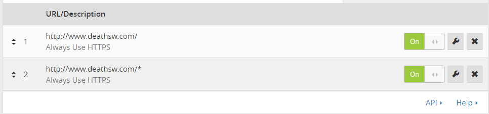

### Github Pages应用自定义域名
默认情况下访问GitHub Pages页面的域名为`username.github.io`，如果需要使用自己的域名（以下简称“你的域名”），可[参考官方的帮助文档](https://help.github.com/articles/using-a-custom-domain-with-github-pages/)，其实非常简单：
1. 在repo根目录下创建CNAME文件，内容为你的域名。
2. 在你的域名管理中心，添加一条CNAME记录，指向`username.github.io`。（将username替换为你的GitHub用户名）

现在，访问`http://你的域名` ，已经可以访问到站点首页了。而如果访问`http://username.github.io` （即原来的地址），将被302跳转到`http://你的域名`。
<!--more-->
### Https的问题
尝试直接访问`https://你的域名`，浏览器会报`SSL_DOMAIN_NOT_MATCHED`警告。因为GitHub Pages默认提供的SSL证书的根域名是`github.io`，和你的域名不相同。
而且，GitHub Pages不支持上传SSL证书。
### 使用CloudFlare
1. 首先去[https://www.cloudflare.com/](https://www.cloudflare.com/)注册账户，配置好你的网站，然后把你域名的DNS服务换成cloudflare提供给你的DNS
2. 在cloudflare的Crypto页中，SSL设置为Flexible。这将允许CDN到github pages之间的访问为http。

### 强制https
cloudflare提供`Page Rules`功能，可设置路由规则。通过规则中的`Always use https`选项，可以将用户强制跳转到https。

### 配置文件
1. 站点配置文件_config.yml添加如下配置(_config.yml配置文件是主题里的)
```url
url: https://www.yoursite.com   # with the https protocol
enforce_ssl: www.yoursite.com   # without any protocol
# 例:
url: https://blog.deathsw.com
enforce_ssl: blog.deathsw.com
```
2. 主题的head文件添加以下配置
  修改文件为\themes\next\layout\\_partials下的head.swig
```js
<link rel="canonical" href=" { { site.url } }{ { page.url } }" />
 <script type="text/javascript">
    var host = "yoursite.com";
    if ((host == window.location.host) && (window.location.protocol != "https:"))
        window.location.protocol = "https";
</script>
```
现在，通过`https://你的域名`已经可以访问站点首页了。

参考：
[https://sheharyar.me/blog/free-ssl-for-github-pages-with-custom-domains/](https://sheharyar.me/blog/free-ssl-for-github-pages-with-custom-domains/)
[https://blog.chionlab.moe/2016/01/28/github-pages-with-https/](https://blog.chionlab.moe/2016/01/28/github-pages-with-https/)